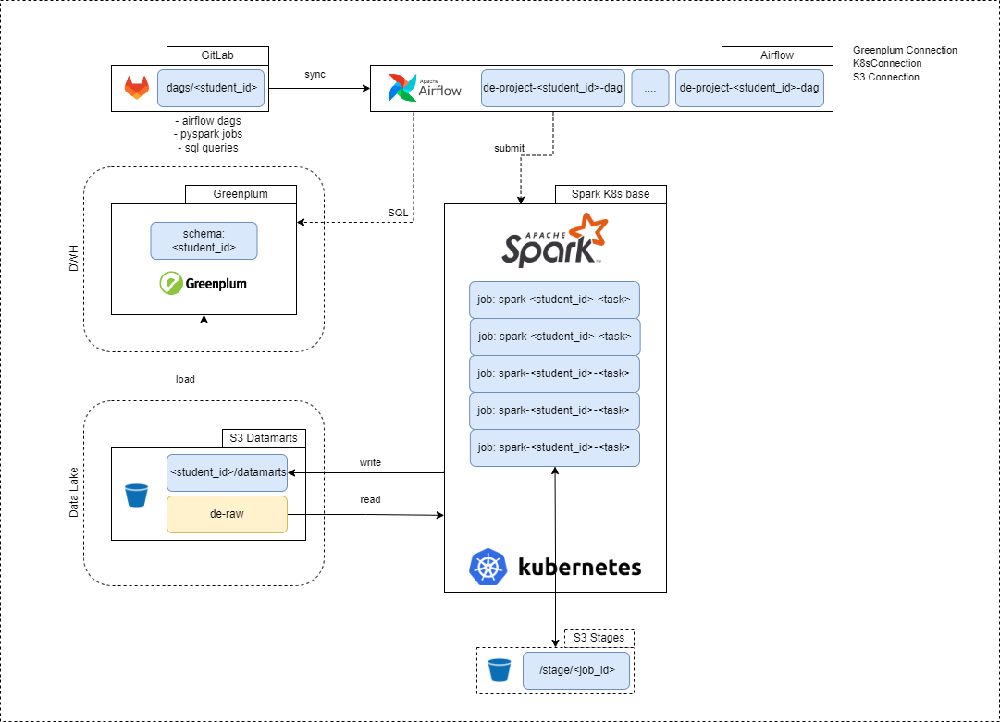
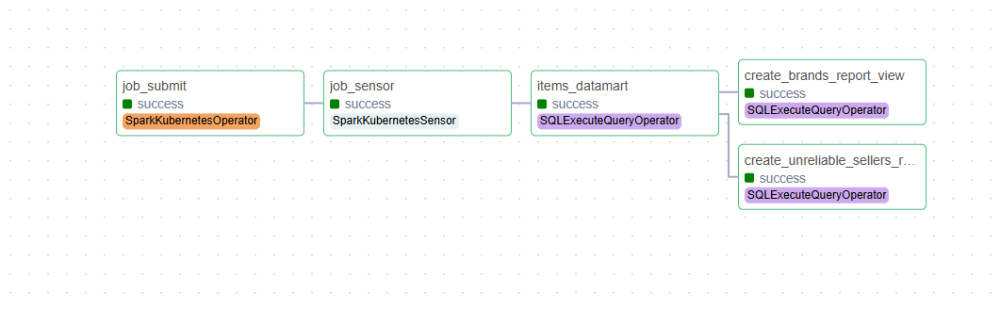

# Airflow-пайплайн создания аналитической витрины
***********

# Цель
Создать витрину данных для аналитиков, которая будет содержать агрегированные метрики по карточкам товаром, популярным категориям и прочим.
***********

# Этапы проекта
1. Разработка Spark-приложения
2. Cоздание запросов о построении Greenplum - витрины
3. Автоматизация пайплайна обработки данных посредством создания DAGa
************

# Примененные технологии
- PySpark
- Airflow
- S3
- PostgreSQL
- Greenplum
*************

# Инфраструктура

В качестве технической инфраструктуры были использованы следующие инструменты:

1. Озеро данных на базе S3
2. Аналитическое хранилище на базе Greenplum
3. Оркестратор потоков данных - Airflow
4. Кластер распределенных вычислений Spark (Kubernetes)
5. GitLab для хранения исходного кода
**************

# Описание 
В S3 находится бакет start-de-raw (VK.Cloud) c исходными данными в формате parquet, доступными только для чтения.
Данные содержат информацию о товарах. Каждая запись соответствует одной карточке товара.
Для доступа к S3 хранилищу и просмотру его содержимого использовался СyberDuck.

## Описание данных
- sku_id - Уникальный идентификатор товара (Stock Keeping Unit). Используется для однозначной идентификации товара в системе
- title	- Название товара, указанное продавцом
- category - Категория товара, к которой он относится (например, "Электроника", "Одежда", "Дом и сад")
- brand	- Название бренда, производящего товар
- seller - Название или идентификатор продавца, разместившего товар на платформе
- group_type	- Группа товара, к которой он относится (например, "Смартфоны", "Кроссовки", "Кухонная техника")
- country	- Страна производства товара
- availability_items_count	- Текущее количество товара в наличии на складах
- ordered_items_count	- Общее количество товара, которое было заказано (включая уже проданные и недоступные единицы)
- warehouses_count	- Количество складов, на которых размещен товар
- item_price	- Текущая цена товара
- goods_sold_count	- Количество успешно проданных единиц товара 
- item_rate	- Рейтинг товара, рассчитанный на основе отзывов пользователей (например, 4.5 из 5)
- days_on_sell	- Количество дней, прошедших с момента размещения товара на платформе
- avg_percent_to_sold	- Средний процент выкупа товара (отношение количества проданных единиц к общему количеству заказов)

Исходные данные были дополнены нескольким метриками, рассчитанными на Kubernetes-кластере распределенных вычислений Spark (seller_item_spark_job.py), и размещены в виде отчета seller_items в Greenplum хранилище.

- returned_items_count - количество товаров на которое оформлен возврат
- potential_revenue	- потенциальных доход от остатков товаров
- total_revenue	- доход от выполненных заказов с учетом возвратов
- avg_daily_sales	- среднее количество продаж с момента запуска
- days_to_sold	- количество дней которое потребуется для продажи всех доступных остатков товара
- item_rate_percent	- относительный ранг (т. е. процентиль)

Для построения витрин была использована Greenplum PXF - технология, позволяющая создавать внешние таблицы в Greenplum над отчетами из внешнего хранилища S3.

На основе seller_items была создан и размещен в Greenplum еще один отчет - unreliable_sellers_view (ненадежные продавцы).

- seller - информация о продавце
- total_overload_items_count	- количество товаров на складах
- is_unreliable	- признак ненадежности (критерии: товар на площадке более 100 дней и кол-во товара на складе больше, чем в заказах) 

Так же на основе seller_items была создан отчет по брендам - item_brands_view.

- brand	- имя бренда
- group_type	- группа товаров
- country	- страна
- potential_revenue	- суммарный итоговый потенциальный доход
- total_revenue	- суммарный итоговый доход
- items_count	- количество позиций бренда

Процесс создания запросов о построении Greenplum - витрины был автоматизирован с помощью DAG Airflow.

# Итоговый DAG
Были использованы следующие Airflow-операторы:

- SQLExecuteQueryOperator - для создания отчетов
- SparkKubernetesOperator - для отправки Spark задач на кластер
- SparkKubernetesSensor - для отслеживания статуса Spark задач

